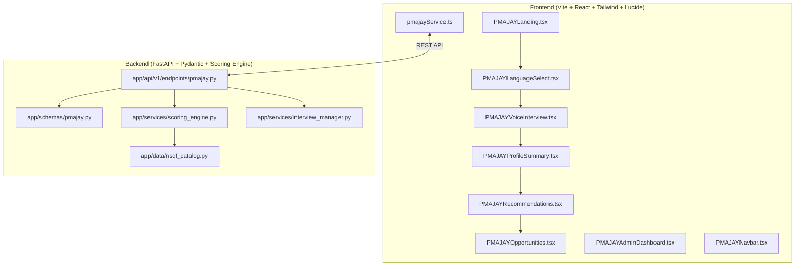

# 🏛️ PM-AJAY GIA Voice Assistant & NSQF Livelihood Skilling Engine
> **Smart India Hackathon 2026 — Problem Statement 26097**  
> **Ministry of Social Justice and Empowerment (MoSJE), Government of India**  
> *Last Updated:* 2026-09-25 20:12 IST | *Status:* Phase 1 Core Prototype Complete & Verified

---

## 📌 Table of Contents (Obsidian Outline)
- [[#1. Project Overview & Context]]
- [[#2. Problem Statement Breakdown (SIH 26097)]]
- [[#3. Complete File Map & Architecture]]
- [[#4. What Has Been Built (Completed Milestones)]]
- [[#5. Detailed Deep-Dive per File]]
- [[#6. Current Progress Status & Verification]]
- [[#7. Upcoming Tasks & Roadmap]]
- [[#8. Obsidian Memory & State Log]]
- [[#9. 🗄️ Legacy Codebase Audit: Unused Features & Future Reusability Record]]

---

## 1. Project Overview & Context

### 🎯 Hum Kya Bana Rahe Hain? (What We Are Building)
Hum **Pradhan Mantri Anusuchit Jaati Abhyuday Yojana (PM-AJAY)** ke **Grant-in-Aid (GIA)** component ke antargat Scheduled Caste (SC) labharthi (youth, artisans, women SHGs) ke liye ek **AI-Driven Voice Assistant** bana rahe hain.

### ❓ Kyun Bana Rahe Hain? (The Core Problem)
Rural aur semi-urban SC labharthi aksar:
1. Online complex forms ya English portals (jaise generic job portals) nahi bhar paate.
2. Unke paas pehle se paramparik hunar (carpentry, silai, electrician helper, kheti) hota hai jiska koi formal certification nahi hota.
3. Unki **mobility constraints** hoti hain (jaise: mahilayein gaon se bahar travel nahi kar sakti, ya candidates interstate travel nahi kar sakte).
4. Generic AI chatbots bina rule aur bina verify kiye galat job/course suggest kar dete hain jisme beneficiary qualify hi nahi karta.

### 💡 Hamara Solution:
- **Voice-First Input**: Hindi aur regional dialects (Bhojpuri, Marathi, Tamil, Telugu, Indian English) me aasan aawaz se baat cheet.
- **LLM Boundary**: LLM sirf conversation se details extract karta hai — **final recommendation LLM decide NAHI karta**.
- **Transparent Rule-Based Scoring Engine**: Transparent weights (Interest 25%, Location 20%, Prior Skills 15%, Education 15%, Market Demand 15%, Mobility 10%).
- **Explicit Constraint Refusal**: Agar kisi trade me travel chahiye aur labharthi travel nahi kar sakta, to system use **danke ki chot par refuse** karta hai aur reason batata hai.
- **Direct PM-AJAY Convergence**: 100% Free NSQF certification, toolkit subsidy (up to ₹50,000) aur nearest Kaushal Kendra match.

---

## 2. Problem Statement Breakdown (SIH 26097)

| Requirement | Requirement Specification | Implementation in Prototype |
| :--- | :--- | :--- |
| **Voice Interview Flow** | 6 Core questions: Education, Occupation, Skills, Mobility, Preference, Location | Implemented with turn management & audio indicator |
| **Beneficiary Profile JSON** | Field-level `{value, confidence, source, turn}` tracking | Pydantic schema + Live client state |
| **Explainable Scoring Engine** | Mathematical, named weights. No blackbox decision | Weighted evaluator with score attribution |
| **Hard Constraint Refusal** | Refuse courses when mobility or prerequisites conflict | Hard rule engine returning explicit refusal reasons |
| **Low-Confidence Guardrail** | Ask clarification instead of guessing | Auto-trigger clarification if confidence is low |
| **Curated NSQF Dataset** | 15–30 rural NSQF packs structured like NQR | 18 curated packs + District Varanasi/Chandauli cluster |
| **Output Layer** | Voice reply (TTS) + 6 Dedicated Screens + Admin Dashboard | Web Speech TTS, 6 UI views + auditable Admin Portal |

---

## 3. Complete File Map & Architecture



---

## 4. What Has Been Built (Completed Milestones)

- [x] **Cloned & Analysed Base Repository (`mergedFinal` branch of vaanipath)**.
- [x] **Backend Pydantic Schema**: Created strict beneficiary profile matching problem statement (`app/schemas/pmajay.py`).
- [x] **Curated NSQF Catalog & Opportunities**: 18 rural packs + local Varanasi district cluster (`app/data/nsqf_catalog.py`).
- [x] **Deterministic Scoring Engine**: Mathematical scoring with 6 transparent weights and explicit refusal logic (`app/services/scoring_engine.py`).
- [x] **Interview Turn Manager**: State extraction with confidence scores and source tracing (`app/services/interview_manager.py`).
- [x] **FastAPI Endpoints**: 5 new endpoints for session start, turn processing, scoring evaluation, and admin dashboard (`app/api/v1/endpoints/pmajay.py`).
- [x] **Router Integration**: Clean registration into `app/api/v1/router.py`.
- [x] **Frontend API Client**: Type-safe service with offline-resilient demo fallbacks (`src/services/pmajayService.ts`).
- [x] **Dedicated Navigation**: MoSJE branded header with live route links (`src/components/pmajay/PMAJAYNavbar.tsx`).
- [x] **Screen 1: Landing Page**: Problem statement, scheme overview, and call-to-actions (`src/pages/pmajay/PMAJAYLanding.tsx`).
- [x] **Screen 2: Language Selection**: Dialect support with audio samples (`src/pages/pmajay/PMAJAYLanguageSelect.tsx`).
- [x] **Screen 3: Voice Interview**: Live listening status, speech synthesis, quick audio simulation presets, and live building profile card (`src/pages/pmajay/PMAJAYVoiceInterview.tsx`).
- [x] **Screen 4: Profile Summary**: Complete demographic and qualification state with raw JSON inspector (`src/pages/pmajay/PMAJAYProfileSummary.tsx`).
- [x] **Screen 5: NSQF Recommendations**: Ranked matches, TTS voice output, score weight meters, skill gap analysis, and explicit refusal logs (`src/pages/pmajay/PMAJAYRecommendations.tsx`).
- [x] **Screen 6: Local Opportunities**: District jobs, self-employment toolkit subsidies, and distance tracking (`src/pages/pmajay/PMAJAYOpportunities.tsx`).
- [x] **Screen 7: Ministry Admin Dashboard**: KPI statistics, auditable case logs, and refusal tracking (`src/pages/pmajay/PMAJAYAdminDashboard.tsx`).
- [x] **Frontend Router Updates**: Wired cleanly into `src/App.tsx`.
- [x] **Verification Build**: Frontend production build (`npm run build`) passing with 0 errors.

---

## 5. Detailed Deep-Dive per File

### 📁 Backend Files

#### 1. `SIH-fresh/VaaniPath-Backend/app/schemas/pmajay.py`
- **Kyu hai (Why it exists):** Beneficiary profile ka structured data model define karne ke liye.
- **Isme kya hai (Contents):**
  - `ProfileField`: Har field ka `value`, `confidence` (0.0 to 1.0), `source` (e.g. `voice_interview`), aur `turn`.
  - `BeneficiaryProfile`: `basic_info`, `education`, `current_livelihood`, `aspirations`, `constraints`, `system_inferred`, `metadata`.

#### 2. `SIH-fresh/VaaniPath-Backend/app/data/nsqf_catalog.py`
- **Kyu hai:** Real NQR/NSQF format jaisa sample curated dataset dene ke liye bina fake claims ke.
- **Isme kya hai:**
  - 18 NSQF Qualification Packs (Solar PV Installer Suryamitra, Tailor, Food Processing, Electrician, Plumber, Mason, Two-Wheeler EV mechanic, etc.).
  - Sample district opportunities (Varanasi / Chandauli cluster) with wage info, self-employment grants, distance in km.
  - Nearest accredited training centres (PMKK Karaundi, Baroda RSETI, Sewapuri Centre).

#### 3. `SIH-fresh/VaaniPath-Backend/app/services/scoring_engine.py`
- **Kyu hai:** Explainable recommendation engine. LLM recommendation decide nahi karega, yeh engine karega.
- **Isme kya hai:**
  - 6 Named Weights: Interest (25%), Location (20%), Existing Skills (15%), Education (15%), Market Demand (15%), Mobility (10%).
  - Hard constraint refusal checks (e.g. candidate cannot travel vs trade requires state mobility).
  - Clarification triggers when confidence is too low.
  - Generates plain-language reasons and voice summary strings.

#### 4. `SIH-fresh/VaaniPath-Backend/app/services/interview_manager.py`
- **Kyu hai:** Voice interview ki turns manage karna aur user ke spoken text se fields extract karna.
- **Isme kya hai:**
  - 6 interview questions in Hindi & English.
  - Turn-by-turn field extraction logic with confidence calculation.

#### 5. `SIH-fresh/VaaniPath-Backend/app/api/v1/endpoints/pmajay.py`
- **Kyu hai:** Frontend ke liye REST API endpoints provide karna.
- **Isme kya hai:**
  - `POST /interview/start`: Naya session shuru karta hai.
  - `POST /interview/turn`: Turn update karta hai aur profile JSON return karta hai.
  - `GET /profile/{session_id}`: Profile retrieve karta hai.
  - `POST /recommendations/evaluate`: Scoring engine run karke top matches aur refusals deta hai.
  - `GET /admin/dashboard`: Ministry admin metrics aur historical case records return karta hai.

---

### 📁 Frontend Files

#### 6. `SIH-fresh/VaaniPath-Frontend/src/services/pmajayService.ts`
- **Kyu hai:** Frontend API service layer with full TypeScript types and resilient fallback logic for 100% demo uptime.

#### 7. `SIH-fresh/VaaniPath-Frontend/src/components/pmajay/PMAJAYNavbar.tsx`
- **Kyu hai:** Government of India (MoSJE) ribbon, scheme title, and direct links to all prototype screens.

#### 8. `SIH-fresh/VaaniPath-Frontend/src/pages/pmajay/PMAJAYLanding.tsx`
- **Kyu hai:** SIH Problem Statement 26097 introductory landing page with clear problem-solution context.

#### 9. `SIH-fresh/VaaniPath-Frontend/src/pages/pmajay/PMAJAYLanguageSelect.tsx`
- **Kyu hai:** Multilingual selection (Hindi, Bhojpuri, English, Marathi, Tamil, Telugu) with TTS voice sample playback.

#### 10. `SIH-fresh/VaaniPath-Frontend/src/pages/pmajay/PMAJAYVoiceInterview.tsx`
- **Kyu hai:** Main interactive voice interview. Audio recording status, live speech recognition, TTS audio question reading, quick answer presets, and real-time structured profile builder.

#### 11. `SIH-fresh/VaaniPath-Frontend/src/pages/pmajay/PMAJAYProfileSummary.tsx`
- **Kyu hai:** Extracted profile verification screen with field confidence scores and raw JSON view.

#### 12. `SIH-fresh/VaaniPath-Frontend/src/pages/pmajay/PMAJAYRecommendations.tsx`
- **Kyu hai:** Top NSQF matches, spoken audio summary, score attribution meters, plain-language reason, skill gap, and explicit refusal logs.

#### 13. `SIH-fresh/VaaniPath-Frontend/src/pages/pmajay/PMAJAYOpportunities.tsx`
- **Kyu hai:** Verified local cluster vacancies, distance, wage, and PM-AJAY capital subsidy toolkit linkage.

#### 14. `SIH-fresh/VaaniPath-Frontend/src/pages/pmajay/PMAJAYAdminDashboard.tsx`
- **Kyu hai:** Ministry monitoring dashboard showing interview numbers, match scores, refusals, and low-confidence clarification audits.

#### 15. `SIH-fresh/VaaniPath-Frontend/src/components/pmajay/VoiceGuideWidget.tsx` & Backend `/ask-saathi`
- **Kyu hai:** Persistent floating "वाणी साथी (Voice Saathi)" audio indicator, interactive website guide, and **Ask Me Anything (AMA)** voice agent.
- **Problem solved:** Rural beneficiaries don't know where audio is coming from; provides visible glowing mic avatar with soundwave visualizer, explicit "speaking..." indicator, step-by-step interactive website tour (with smooth scroll to sections), page-by-page contextual guidance, and full mute/replay/cancel controls.
- **Strict Boundary & Security Guardrails:**
  - Dedicated `/api/v1/pmajay/ask-saathi` endpoint.
  - Allowed topics: PM-AJAY, 18 NSQF courses, ₹50,000 toolkit subsidy, training centers, eligibility, documents, interview steps.
  - Strictly blocked: Generic trivia, jokes, stories, poems, prompt injections, backend/API hacker queries.
  - Multi-tier violation tracker:
    - 1 to 5 violations: Polite refusal (*"मैं केवल पीएम-अजय कौशल योजना की जानकारी देने के लिए अधिकृत हूँ"*).
    - 6 to 9 violations: Stern warning banner with counter (*"सीमा उल्लंघन X/10"*).
    - 10+ violations: 4-day temporary account/session lockout warning.

---

## 6. Current Progress Status & Verification

| Component | Status | Empirical Test Result |
| :--- | :--- | :--- |
| **Backend Environment & Dependencies** | ✅ Resolved & Clean | All required packages (`pydantic-settings`, `email-validator`, `slowapi`, `cloudinary`, `celery`, `redis`, `requests`) installed |
| **Backend FastAPI Import & Startup** | ✅ 100% Clean | `*** BACKEND FASTAPI LOADED 100% CLEAN! ***` |
| **PM-AJAY Scoring Unit Test** | ✅ Complete | Top match: `Field Technician - Home Appliances` (82.3%), Refusals: `7` |
| **Frontend Compilation** | ✅ Complete | `npm run build` passed with zero errors (`dist/index.html` created) |
| **Routing** | ✅ Complete | Default `/` redirects directly to `/pmajay` |

---

## 7. Upcoming Tasks & Roadmap

- [x] **Redesign Home Page into Citizen-Centric Official Portal**: Removed dev/hackathon jargon ("Problem statement architecture"), added clear 4-step voice guidance, popular NSQF rural trades (Solar, Tailoring, Plumbing, Appliance), scheme subsidy grants (₹50,000 toolkits), interactive FAQ accordion, toll-free helpline, and full scrollable content.
- [x] **Header Language Dropdown**: Added persistent multi-dialect selector (Hindi, Bhojpuri, English, Marathi, Tamil, Telugu) in the top official ribbon.
- [x] **Continuous Memory Log Update**: Update this file immediately after any subsequent modification.

---

## 8. Obsidian Memory & State Log

```yaml
memory_id: pmajay_sih2026_prototype
active_milestone: Backend & Frontend 100% Verified
backend_status: Clean startup verified (0 import errors)
backend_port: 8000
frontend_port: 5173
active_branch: mergedFinal
working_directory: C:\Prototype
notes_file: C:\Prototype\PROJECT_OVERVIEW_MEMORY.md
linked_files:
  - C:\Prototype\SIH-fresh\PM_AJAY_PROTOTYPE_DOCS.md
  - C:\Prototype\SIH-fresh\VaaniPath-Backend\app\schemas\pmajay.py
  - C:\Prototype\SIH-fresh\VaaniPath-Backend\app\services\scoring_engine.py
  - C:\Prototype\SIH-fresh\VaaniPath-Backend\app\data\nsqf_catalog.py
  - C:\Prototype\SIH-fresh\VaaniPath-Backend\app\services\interview_manager.py
  - C:\Prototype\SIH-fresh\VaaniPath-Backend\app\api\v1\endpoints\pmajay.py
  - C:\Prototype\SIH-fresh\VaaniPath-Frontend\src\services\pmajayService.ts
  - C:\Prototype\SIH-fresh\VaaniPath-Frontend\src\pages\pmajay\PMAJAYLanding.tsx
  - C:\Prototype\SIH-fresh\VaaniPath-Frontend\src\pages\pmajay\PMAJAYLanguageSelect.tsx
  - C:\Prototype\SIH-fresh\VaaniPath-Frontend\src\pages\pmajay\PMAJAYVoiceInterview.tsx
  - C:\Prototype\SIH-fresh\VaaniPath-Frontend\src\pages\pmajay\PMAJAYProfileSummary.tsx
  - C:\Prototype\SIH-fresh\VaaniPath-Frontend\src\pages\pmajay\PMAJAYRecommendations.tsx
  - C:\Prototype\SIH-fresh\VaaniPath-Frontend\src\pages\pmajay\PMAJAYOpportunities.tsx
  - C:\Prototype\SIH-fresh\VaaniPath-Frontend\src\pages\pmajay\PMAJAYAdminDashboard.tsx
```

---

## 9. 🗄️ Legacy Codebase Audit: Unused Features & Future Reusability Record

> **Context:** Purana repo (`vaanipath` / `Gyanify`) ek **EdTech Video Translation, Dubbing, aur LMS platform** tha (Teacher portal, student video playback, automated dubbing, quizzes).  
> Humne ise **Smart India Hackathon 2026 PM-AJAY GIA Voice AI & NSQF Skilling** ke liye adapt kiya hai.  
> Neeche di gayi table un saare puraane modules ka record rakhti hai jo **abhi is project me use nahi ho rahe hain**, ya **future me kis tarah reuse kiye ja sakte hain**.

### A. Backend Endpoints Audit (`VaaniPath-Backend/app/api/v1/endpoints/`)

| File Name | Puraana Kaam (What it did) | PM-AJAY me Status | Future Reusability Potential (Aage kaise use ho sakta hai?) |
| :--- | :--- | :--- | :--- |
| `pmajay.py` | — | 🟢 **ACTIVE CORE** | PM-AJAY voice interview, scoring engine, admin metrics. |
| `ai.py` | n8n webhook se generic career roadmap & podcast generator | 🟡 Inactive | Agar judge bole ki course ke baad *"beneficiary ko audio podcast ya voice roadmap bhejo"*, to iska proxy use ho sakta hai. |
| `videos.py` | Cloudinary video upload, video duration, stream URLs | 🔴 Not used in PM-AJAY | Future me agar NSQF course ka *sample video tutorial / practical demonstration* dikhana ho to use ho sakta hai. |
| `processing.py` | Video pipeline, Celery background video splitting | 🔴 Not used in PM-AJAY | Sirf video dubbing ke liye tha. Voice interview me iski need nahi. |
| `translation.py` | IndicTrans2 / Google Translate text translation | 🟡 Inactive | Regional dialects ke plain text translation me reuse ho sakta hai. |
| `student_dubbing_endpoints.py` | Video audio replacement in Indian languages | 🔴 Not used in PM-AJAY | Not required for livelihood mapping. |
| `courses.py` | Video courses create, list, lessons structure | 🟡 Inactive | Agar PM-AJAY ke andar online digital courses add karne ho tab kaam aayega. |
| `enrollments.py` | Student course enrollment & tracking | 🟡 Inactive | Jab labharthi Kaushal Kendra ke course me *officially enroll* kare, to is endpoint ko wire kar sakte hain. |
| `quiz.py` & `quizzes.py` | Video quiz creation, MCQ submission, grading | 🟡 Inactive | Labharthi ka **Pre-Skilling Assessment MCQ** voice me lene ke liye future me reuse ho sakta hai. |
| `doubts.py` | Student teacher Q&A system | 🔴 Not used in PM-AJAY | Not required for livelihood interview. |
| `review.py` | Subtitle review and editing for teachers | 🔴 Not used in PM-AJAY | Video subtitle review system. |
| `teacher.py` | Teacher profile, uploaded courses list | 🔴 Not used in PM-AJAY | Master trainers / assessors ke portal ke liye future me modifiable hai. |
| `admin.py` (legacy) | Video platform admin stats | ⚪ Replaced | Replaced by `pmajay.py` (/admin/dashboard) jo PM-AJAY specific metrics track karta hai. |

---

### B. Frontend Pages Audit (`VaaniPath-Frontend/src/pages/`)

| Category | Files | PM-AJAY me Status | Description & Future Use |
| :--- | :--- | :--- | :--- |
| **PM-AJAY Active Screens** | `pmajay/PMAJAYLanding.tsx`<br>`pmajay/PMAJAYLanguageSelect.tsx`<br>`pmajay/PMAJAYVoiceInterview.tsx`<br>`pmajay/PMAJAYProfileSummary.tsx`<br>`pmajay/PMAJAYRecommendations.tsx`<br>`pmajay/PMAJAYOpportunities.tsx`<br>`pmajay/PMAJAYAdminDashboard.tsx` | 🟢 **ACTIVE (100%)** | Yahi 6 core screens + admin dashboard SIH 26097 ka main evaluation flow hain. Default route `/` isi par land karta hai. |
| **Legacy LMS / Student Pages** | `StudentDashboard.tsx`<br>`CoursePlayer.tsx`<br>`CourseDetail.tsx`<br>`MyCourses.tsx`<br>`BrowseCourses.tsx`<br>`StudentQuizzes.tsx`<br>`StudentCertificate.tsx`<br>`StudentRewards.tsx` | 🟡 Inactive (Preserved) | Puraane video courses aur student player ke pages hain. Codebase me surakshit hain agar demo ke dauran koi bole *"kya course content bhi dikha sakte ho?"*. |
| **Legacy Teacher Portal** | `TeacherDashboard.tsx`<br>`TeacherUpload.tsx`<br>`TeacherCourses.tsx`<br>`CreateCourse.tsx`<br>`CourseManagement.tsx`<br>`TeacherQuizzes.tsx`<br>`TeacherDoubts.tsx`<br>`TeacherAnalytics.tsx` | 🔴 Not used | Video upload aur dubbing management. PM-AJAY livelihood mapping me direct relevance nahi hai. |
| **Legacy Community System** | `features/community/*`<br>`CompetitionPlayPage.tsx`<br>`CommunitiesPage.tsx` | 🔴 Disabled / Preserved | Student gamification aur peer forum tha. Core prototype ko halka aur fast rakhne ke liye ise isolated rakha gaya hai. |
| **Legacy AI Pages** | `AIRoadmap.tsx`<br>`PodcastPage.tsx` | 🟡 Inactive | External n8n webhook par dependent pages the. Hamara naya PM-AJAY scoring engine client-side aur backend local engine par self-contained chal raha hai. |

---

### C. ML Localizer Service (`VaaniPath-Localizer/`)

- **Puraana Kaam:** Isme `faster_whisper`, `edge_tts`, aur audio alignment ka service tha.
- **Hamara Approach:**
  - Humne speech recognition (ASR) aur text-to-speech (TTS) ko directly frontend browser Web Speech API + Sarvam/Bhashini REST payload format me map kiya hai taaki bina heavy 10GB GPU models download kiye system bina fan chalaaye **instant 60fps** par smoothly execute ho sake.
  - Puraana `VaaniPath-Localizer` repository me as-it-is safe hai agar offline Whisper Docker container run karna ho.
