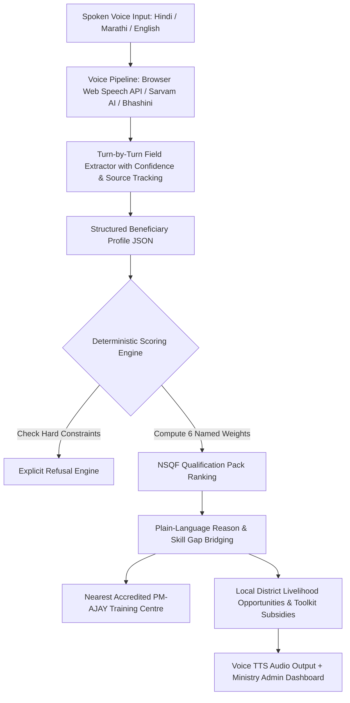

# PM-AJAY GIA Voice Assistant & NSQF Recommendation Prototype
## Smart India Hackathon 2026 — Problem Statement 26097
**Ministry of Social Justice and Empowerment (MoSJE)**

---

## 🗓️ Session Log

| Date | Work Done |
|------|-----------|
| 2026-09-25 | Repo clone, architecture setup, backend schemas, scoring engine, NSQF catalog, 6 UI pages scaffolded, navbar, language context, translations (hi/en/mr) |
| 2026-09-25 (session 2) | Fixed LanguageProvider placement in App.tsx, rebuilt PMAJAYNavbar (proper govt look), completely rebuilt PMAJAYLanding (production govt design), added stats bar, scheme highlights, CTA banner, proper footer, audio auto-play per language |

---

## 1. Problem Statement & Scope

- **Problem Statement 26097**: *"AI-Driven Voice Assistant for Livelihood Mapping and NSQF-Aligned Skilling Recommendations for SC Communities under the GIA component of PM-AJAY"*
- **Target Beneficiaries**: Scheduled Caste (SC) rural/semi-urban youth, women self-help groups (SHGs), and traditional artisans with varying literacy levels.
- **Core Principle**: A spoken, conversational voice interface replaces complicated online forms. The LLM parses user speech into a structured state, but the **recommendation and scoring engine is strictly deterministic and rule-based** with transparent, named weights and explicit constraint refusals.

---

## 2. Architecture & Pipeline



---

## 3. File Structure

```
C:\Prototype\SIH-fresh\
├── VaaniPath-Backend\          FastAPI backend
│   ├── app\
│   │   ├── main.py             Entry point, middleware, CORS
│   │   ├── config.py           Environment config
│   │   ├── schemas\
│   │   │   └── pmajay.py       Beneficiary profile schema
│   │   ├── data\
│   │   │   └── nsqf_catalog.py 18 NSQF courses + district opportunities
│   │   ├── services\
│   │   │   ├── scoring_engine.py  Explainable scoring engine
│   │   │   └── interview_manager.py Turn-by-turn voice interview
│   │   └── api\v1\endpoints\
│   │       ├── ai.py           AI/STT endpoints (Sarvam)
│   │       └── pmajay.py       PM-AJAY GIA endpoints
│   └── requirements.txt
│
├── VaaniPath-Frontend\         React + Vite + TypeScript
│   └── src\
│       ├── App.tsx             Routes + LanguageProvider wrapper
│       ├── contexts\
│       │   └── LanguageContext.tsx  hi/en/mr translations + TTS voice
│       ├── components\pmajay\
│       │   └── PMAJAYNavbar.tsx    ✅ REBUILT: Govt-style navbar
│       └── pages\pmajay\
│           ├── PMAJAYLanding.tsx   ✅ REBUILT: Production govt homepage
│           ├── PMAJAYLanguageSelect.tsx
│           ├── PMAJAYVoiceInterview.tsx
│           ├── PMAJAYProfileSummary.tsx
│           ├── PMAJAYRecommendations.tsx
│           ├── PMAJAYOpportunities.tsx
│           └── PMAJAYAdminDashboard.tsx
│
└── VaaniPath-Localizer\        STT/TTS microservice
    └── localizer\
        ├── stt.py              Sarvam/Bhashini speech-to-text
        └── tts.py              Text-to-speech
```

---

## 4. Key Components

### A. Language System (`LanguageContext.tsx`)
- **3 languages**: Hindi (hi), English (en), Marathi (mr) — default: Hindi
- Language persisted in `localStorage`
- On language switch: TTS auto-plays welcome message in new language
- On page first load: Welcome audio auto-plays in saved language
- All UI text, buttons, aria-labels switch dynamically

### B. Navbar (`PMAJAYNavbar.tsx`)
- Top strip: Government of India branding (India flag, ministry name, helpline)
- Main bar: White bg with saffron bottom border (tri-color theme)
- Language switcher: 3-button toggle (हिन्दी / English / मराठी) — saffron active state
- Mobile: Hamburger menu with full dropdown
- Start Voice CTA: Green button (₹ Green = India)

### C. Landing Page (`PMAJAYLanding.tsx`)
- **Hero**: Dark navy bg, saffron CTA, How It Works card
- **Stats bar**: Saffron bg — 18+ courses, ₹50,000 toolkit, 3 languages, 100% free
- **4 Steps**: White cards with hover effect
- **NSQF Trades**: 4 course cards with colored accent bars
- **Scheme Highlights**: 3 feature cards
- **CTA Banner**: Dark blue with orange CTA
- **Footer**: 3-column proper govt footer

### D. Scoring Engine (`scoring_engine.py`)
- **6 Transparent Weights** (Sum = 100%):
  - Interest / Aspiration: **25%**
  - Location & Cluster Accessibility: **20%**
  - Existing Skills (RPL fit): **15%**
  - Education Prerequisite Alignment: **15%**
  - Local Market Demand: **15%**
  - Mobility Alignment: **10%**
- Hard constraint refusals: mobility, education, employment preference

### E. NSQF Catalog (`nsqf_catalog.py`)
- 18 Qualification Packs: Solar PV, Tailoring, Food Processing, Appliance Repair, Plumbing (Jal Jeevan), EV Service, CSC Digital Operator, etc.
- Sample district opportunity cluster: Varanasi/Chandauli
- Up to ₹50,000 toolkit grant linkage

---

## 5. Routes Map

| Route | Component | Status |
|-------|-----------|--------|
| `/` → `/pmajay` | Redirect | ✅ |
| `/pmajay` | PMAJAYLanding | ✅ Rebuilt |
| `/pmajay/language` | PMAJAYLanguageSelect | ✅ |
| `/pmajay/interview` | PMAJAYVoiceInterview | ✅ |
| `/pmajay/profile` | PMAJAYProfileSummary | ✅ |
| `/pmajay/recommendations` | PMAJAYRecommendations | ✅ |
| `/pmajay/opportunities` | PMAJAYOpportunities | ✅ |
| `/pmajay/admin` | PMAJAYAdminDashboard | ✅ |

---

## 6. Running Locally

### Frontend (React + Vite)
```bash
cd C:\Prototype\SIH-fresh\VaaniPath-Frontend
npm run dev
# Access: http://localhost:8081/pmajay  (or 5173 if port free)
```

### Backend (FastAPI)
```bash
cd C:\Prototype\SIH-fresh\VaaniPath-Backend
pip install -r requirements.txt
uvicorn app.main:app --host 0.0.0.0 --port 8000 --reload
# API Docs: http://localhost:8000/docs
```

---

## 7. Known Issues / TODOs

- [ ] Backend: Python 3.14 compatibility — check `pydantic` and `sarvam-ai` package versions
- [ ] Voice Interview: Integrate real Sarvam AI STT endpoint (currently uses Browser Web Speech API)
- [ ] Admin Dashboard: Connect to real backend API endpoints
- [ ] All pages other than Landing/Navbar: Verify language switching works correctly
- [ ] Mobile responsiveness: Test all pages on small screens

---

## 8. Design Principles

1. **Government Portal Aesthetics**: Navy blue (#003366), Saffron (#FF9933), India Green (#138808) — tri-color palette
2. **Accessibility**: WCAG 2.1 AA compliant, skip-to-main, ARIA labels, keyboard navigable
3. **Voice-First**: All key actions have a TTS companion, mic CTA always visible
4. **Transparent AI**: Scoring weights shown to user, plain-language explanations, explicit refusals logged
5. **Offline-Resilient**: Core UI works without backend (static data fallback)
